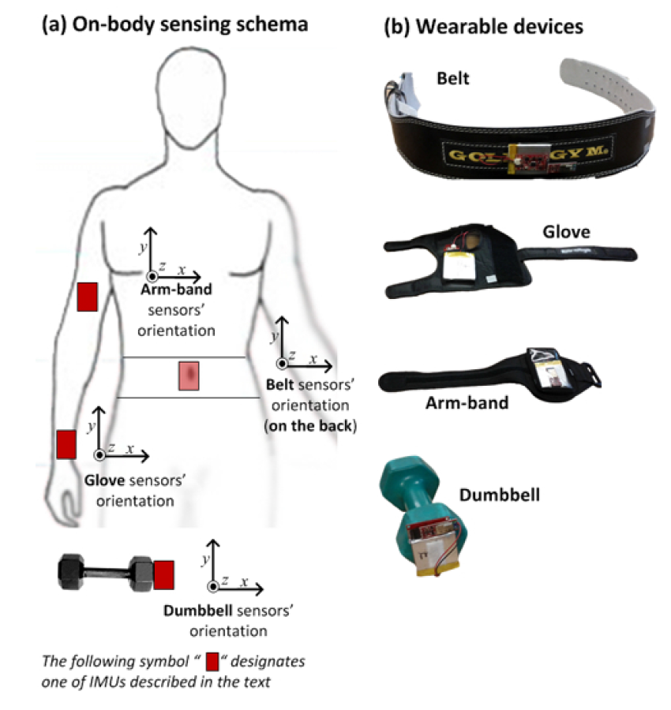

### 1.- Executive Summary

In this document we will examine the use of machine learning techniques to distinguish between bad and good form when executing dumbbell biceps curls using data acquired through sensors in the users' glove, armband, lumbar belt and dumbbell. The algorithm must distinguish between 5 possible ways of performing the exercise, one corresponding to the correct form and four other incorrect way; the data set thus describes activities that correspond to the following classes:

* Class A: Correct form 
* Class B: Throwing the elbows to the front 
* Class C: Lifting the dumbbell only halfway 
* Class D: Lowering the dumbbell only halfway
* Class E: Throwing the hips to the front.

The sensors used in this study measure pitch, roll and yaw angles as well as x-y-z components for acceleration, gyroscope and magnetometer data. The reference coordinate system used can be seen in Fig. 1 of ["Qualitative Activity Recognition of Weight Lifting Exercises"](http://groupware.les.inf.puc-rio.br/work.jsf?p1=11201) by Velloso et al. which is reproduced below. Note the orientation of the cartesian coordinate system associated to the sensors: we will take advantage of this orientation as well as of the mechanics of the dumbbell curl for feature selection purposes. 



### 2.- Preliminary Cleansing

We will first load some required libraries and setting the seed for random number generation. 

```{r loadLibraries, warning=FALSE}
library(caret)
library(ggplot2)
library(corrplot)
library(reshape)
set.seed(1234)
```

We read the data sets into memory,

```{r readData, cache=TRUE}
training0 <- read.csv("pml-training.csv")
testing0 <- read.csv("pml-testing.csv")
```

And print the dimensions of the training and testing sets
```{r dimens1}
dim(training0)
dim(testing0)
```

We notice that the original training set contains 160 columns. In order to get an idea of the particular meaning of each variable we will print column names

```{r theNames}
names(training0)
```
Upon inspection of this list it can be appreciated that variable **classe** is the classification label for each type of activity, and that the first seven variables are not related to data generated by the sensors. We therefore expunge these first seven columns from the training and testing data sets.

```{r clean1}
training1 <- training0[,-c(1:7)]
testing1 <- testing0[,-c(1:7)]
```

We now obtain a summary of the resulting data set

```{r summary}
summary(training1)
```

We can observe that there are a number of columns that either contain either a large number of NAs or a large number of blank spaces; in both cases the number of rows containing such values is 19216, or 98% of the total number of rows in the data set. We can therefore discard the features that correspond to these columns. For this purpose we will define a couple of small functions to count the number of NAs and the number of blank spaces in a column 

```{r theFunctions}
# count NAs in a column
countNA <- function(X) {
  sum(is.na(X))
}

# count blank spaces in a columns
countSP <- function(X) {
  sum(X == "")
}
```

We expunge the columns with NAs or blank spaces from the data sets

```{r clean2}
training2 <- training1[,which(sapply(training1, countNA) == 0)]
testing2 <- testing1[,which(sapply(training1, countNA) == 0)]

training3 <- training2[,which(sapply(training2, countSP) == 0)]
testing3 <- testing2[,which(sapply(training2, countSP) == 0)]
```

The number of features in the training set is now

```{r dimens2}
dim(training3)
```

We can eliminate a few more features from the data set by examining Fig. 1 reproduced above. First we note that the sensors register picth, roll and yaw; however the description of the movements involved in a dumbbell curl involve mostly pitch angles since they take place in the y-z plane. For this reason we can discard those features which are related to yaw or roll angles as well as those corresponding to acceleration or magnetometer components in the x-axis (for a description of picth, roll and yaw angles see [this link](http://en.wikipedia.org/wiki/Aircraft_principal_axes)).

```{r clean3}
# physically relevant variables only
relVars <- grep("pitch?|?_y|?_z|classe", names(training3))
training4 <- training3[,relVars]
testing4 <- testing3[,relVars]

```

The dimension of the resulting cleansed training data set is now

```{r dimens3}
dim(training4)
```

### 3.- Exploratory Feature Analysis & Pre
In order to have an idea of the correlations between features we will plot them using package *Corrplot*

```{r corrs}
correlation <- cor(training4[, -29])
corrplot(correlation, method = "color")
```

An examination of this plot reveals that in somer cases there is a strong correlation between features generated in the same sensor. For instance, it can be seen that **accel_arm_y** and **accel_arm_z** are strongly correalted with **magnet_arm_y** and **magnet_arm_z**. In another case there is strong correlation between particular features generated at different sensors, such as the one observed between **gyros_dumbbell_y**, **gyros_dumbbell_z** and **gyros_forearm_y**, **gyros_forearm_z**; this could be explained by the physical proximith between the glove and dumbbell sensors.

In order to verify that all the features indeed contribute to the variability of the outcome, we will now verify that none of the selected predictors has non-zero variance

```{r nzv}
nzv <- nearZeroVar(training4, saveMetrics=TRUE)
nzv
```

It can be seen that all of the predictors in the reduced training data set are relevant. 

### 4.- Predictive Model

We will build our classification model by using a random forest. First we will split our original training set into two subsets, one to train our model and another to test it.

```{r split}
inTrain <- createDataPartition(y=training4$classe, p=0.7, list=FALSE)
training <- training4[inTrain,]
testing <- training4[-inTrain,]
```

We will use k-fold cross-validation to determine how well the model will generalize to an independent data set; for reasons of efficiency we will use 5 folds.

```{r trainControl}
fitControl <- trainControl(method = "cv", number = 5, savePredictions = TRUE, allowParallel = TRUE)
```

We now proceed to train our model

```{r trainModel, cache=TRUE}
rfModelFit <- train(classe ~ ., data = training, method = "rf", trControl = fitControl)
rfModelFit
```

We can see that across the 5-fold cross-validation the accuracy of our model is over 97%. We now test the model on the testing data obtained from the split of the original training data.

```{r test}
prediction <- predict(rfModelFit, testing)
print(confusionMatrix(prediction, testing$classe))
```
The accuracy of this model is over 99% in our testing data for the particular pseudo-random number generator seed used in this script. We can now obtain a prediction for the test data provided in the original data set

```{r prediction}
predict(rfModelFit, testing4[,-29])
```


